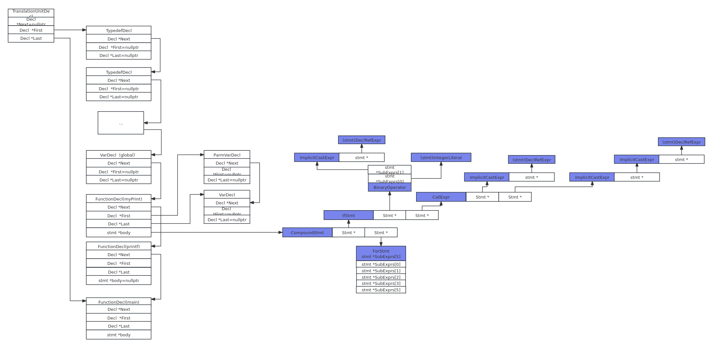

# Decl and Stmt

## Basic concept

There is a reference: https://swtv.kaist.ac.kr/courses/cs453-fall13/Clang%20tutorial%20v4.pdf

## The Structrue between Decls and Stmts...

	clang -Xclang -ast-dump example.c
Use the example.c and print the follow ast dump:

	TranslationUnitDecl 0x564e5d1274a8 <<invalid sloc>> <invalid sloc>
	|-TypedefDecl 0x564e5d127cf8 <<invalid sloc>> <invalid sloc> implicit __int128_t '__int128'
	| `-BuiltinType 0x564e5d127a70 '__int128'
	|-TypedefDecl 0x564e5d127d68 <<invalid sloc>> <invalid sloc> implicit __uint128_t 'unsigned __int128'
	| `-BuiltinType 0x564e5d127a90 'unsigned __int128'
	|-TypedefDecl 0x564e5d128070 <<invalid sloc>> <invalid sloc> implicit __NSConstantString 'struct __NSConstantString_tag'
	| `-RecordType 0x564e5d127e40 'struct __NSConstantString_tag'
	|   `-Record 0x564e5d127dc0 '__NSConstantString_tag'
	|-TypedefDecl 0x564e5d128118 <<invalid sloc>> <invalid sloc> implicit __builtin_ms_va_list 'char *'
	| `-PointerType 0x564e5d1280d0 'char *'
	|   `-BuiltinType 0x564e5d127550 'char'
	|-TypedefDecl 0x564e5d128400 <<invalid sloc>> <invalid sloc> implicit __builtin_va_list 'struct __va_list_tag[1]'
	| `-ConstantArrayType 0x564e5d1283b0 'struct __va_list_tag[1]' 1 
	|   `-RecordType 0x564e5d1281f0 'struct __va_list_tag'
	|     `-Record 0x564e5d128170 '__va_list_tag'
	|-VarDecl 0x564e5d18a6e0 <Example.c:3:1, col:14> col:5 used global 'int' cinit
	| `-IntegerLiteral 0x564e5d18a790 <col:14> 'int' 0
	|-FunctionDecl 0x564e5d18a890 <line:5:1, line:11:1> line:5:6 used myPrint 'void (int)'
	| |-ParmVarDecl 0x564e5d18a7c8 <col:14, col:18> col:18 used param 'int'
	| `-CompoundStmt 0x564e5d18b360 <col:25, line:11:1>
	|   |-IfStmt 0x564e5d18b100 <line:6:3, line:7:24>
	|   | |-BinaryOperator 0x564e5d18a998 <line:6:7, col:16> 'int' '=='
	|   | | |-ImplicitCastExpr 0x564e5d18a980 <col:7> 'int' <LValueToRValue>
	|   | | | `-DeclRefExpr 0x564e5d18a940 <col:7> 'int' lvalue ParmVar 0x564e5d18a7c8 'param' 'int'
	|   | | `-IntegerLiteral 0x564e5d18a960 <col:16> 'int' 1
	|   | `-CallExpr 0x564e5d18b0a8 <line:7:5, col:24> 'int'
	|   |   |-ImplicitCastExpr 0x564e5d18b090 <col:5> 'int (*)(const char *, ...)' <FunctionToPointerDecay>
	|   |   | `-DeclRefExpr 0x564e5d18afc8 <col:5> 'int (const char *, ...)' Function 0x564e5d18ae20 'printf' 'int (const char *, ...)'
	|   |   `-ImplicitCastExpr 0x564e5d18b0e8 <col:12> 'const char *' <NoOp>
	|   |     `-ImplicitCastExpr 0x564e5d18b0d0 <col:12> 'char *' <ArrayToPointerDecay>
	|   |       `-StringLiteral 0x564e5d18b020 <col:12> 'char[11]' lvalue "param is 1"
	|   `-ForStmt 0x564e5d18b328 <line:8:3, line:10:3>
	|     |-DeclStmt 0x564e5d18b1c0 <line:8:8, col:18>
	|     | `-VarDecl 0x564e5d18b138 <col:8, col:16> col:12 used i 'int' cinit
	|     |   `-IntegerLiteral 0x564e5d18b1a0 <col:16> 'int' 0
	|     |-<<<NULL>>>
	|     |-BinaryOperator 0x564e5d18b230 <col:20, col:24> 'int' '<'
	|     | |-ImplicitCastExpr 0x564e5d18b218 <col:20> 'int' <LValueToRValue>
	|     | | `-DeclRefExpr 0x564e5d18b1d8 <col:20> 'int' lvalue Var 0x564e5d18b138 'i' 'int'
	|     | `-IntegerLiteral 0x564e5d18b1f8 <col:24> 'int' 10
	|     |-UnaryOperator 0x564e5d18b270 <col:29, col:30> 'int' postfix '++'
	|     | `-DeclRefExpr 0x564e5d18b250 <col:29> 'int' lvalue Var 0x564e5d18b138 'i' 'int'
	|     `-CompoundStmt 0x564e5d18b310 <col:35, line:10:3>
	|       `-CompoundAssignOperator 0x564e5d18b2e0 <line:9:5, col:15> 'int' '+=' ComputeLHSTy='int' ComputeResultTy='int'
	|         |-DeclRefExpr 0x564e5d18b288 <col:5> 'int' lvalue Var 0x564e5d18a6e0 'global' 'int'
	|         `-ImplicitCastExpr 0x564e5d18b2c8 <col:15> 'int' <LValueToRValue>
	|           `-DeclRefExpr 0x564e5d18b2a8 <col:15> 'int' lvalue Var 0x564e5d18b138 'i' 'int'
	|-FunctionDecl 0x564e5d18ae20 <line:7:5> col:5 implicit used printf 'int (const char *, ...)' extern
	| |-ParmVarDecl 0x564e5d18af20 <<invalid sloc>> <invalid sloc> 'const char *'
	| |-BuiltinAttr 0x564e5d18aec8 <<invalid sloc>> Implicit 967
	| `-FormatAttr 0x564e5d18af90 <col:5> Implicit printf 1 2
	`-FunctionDecl 0x564e5d18b5e8 <line:13:1, line:17:1> line:13:5 main 'int (int, char **)'
	|-ParmVarDecl 0x564e5d18b398 <col:10, col:14> col:14 argc 'int'
	|-ParmVarDecl 0x564e5d18b4c0 <col:20, col:31> col:26 argv 'char **'
	`-CompoundStmt 0x564e5d18b888 <col:34, line:17:1>
	|-DeclStmt 0x564e5d18b778 <line:14:3, col:16>
	| `-VarDecl 0x564e5d18b6f0 <col:3, col:15> col:7 used param 'int' cinit
	|   `-IntegerLiteral 0x564e5d18b758 <col:15> 'int' 1
	|-CallExpr 0x564e5d18b818 <line:15:3, col:16> 'void'
	| |-ImplicitCastExpr 0x564e5d18b800 <col:3> 'void (*)(int)' <FunctionToPointerDecay>
	| | `-DeclRefExpr 0x564e5d18b790 <col:3> 'void (int)' Function 0x564e5d18a890 'myPrint' 'void (int)'
	| `-ImplicitCastExpr 0x564e5d18b840 <col:11> 'int' <LValueToRValue>
	|   `-DeclRefExpr 0x564e5d18b7b0 <col:11> 'int' lvalue Var 0x564e5d18b6f0 'param' 'int'
	`-ReturnStmt 0x564e5d18b878 <line:16:3, col:10>
	`-IntegerLiteral 0x564e5d18b858 <col:10> 'int' 0
		
 