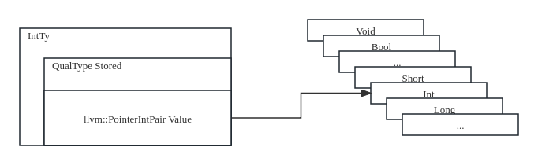

# Clang Type

As known, the int, float, char, struct, union... are the types in c language, but how to represent in clang frontend?

int, float, char was represent by the class BuiltinType, Kind the member of BuiltinType can help us distinguish the types.

int *, float *, char *, was represented by the class PointerType.

struct, union, class was represented by the class RecordType.

int [10], float[10]... was represented by the class ArrayType.

For above types, the can be const, volitate, Restrict, these was represent by QualType, there is some difference.

## class Type
The Basic class is Type:

	class alignas(TypeAlignment) Type : public ExtQualsTypeCommonBase {
	public:
	enum TypeClass {
	#define TYPE(Class, Base) Class,
	#define LAST_TYPE(Class) TypeLast = Class
	#define ABSTRACT_TYPE(Class, Base)
	#include "clang/AST/TypeNodes.inc"
	};

	...

	union {
	TypeBitfields TypeBits;
	ArrayTypeBitfields ArrayTypeBits;
	ConstantArrayTypeBitfields ConstantArrayTypeBits;
	AttributedTypeBitfields AttributedTypeBits;
	AutoTypeBitfields AutoTypeBits;
	TypeOfBitfields TypeOfBits;
	TypedefBitfields TypedefBits;
	UsingBitfields UsingBits;
	BuiltinTypeBitfields BuiltinTypeBits;
	FunctionTypeBitfields FunctionTypeBits;
	ObjCObjectTypeBitfields ObjCObjectTypeBits;
	ReferenceTypeBitfields ReferenceTypeBits;
	TypeWithKeywordBitfields TypeWithKeywordBits;
	ElaboratedTypeBitfields ElaboratedTypeBits;
	VectorTypeBitfields VectorTypeBits;
	SubstTemplateTypeParmTypeBitfields SubstTemplateTypeParmTypeBits;
	SubstTemplateTypeParmPackTypeBitfields SubstTemplateTypeParmPackTypeBits;
	TemplateSpecializationTypeBitfields TemplateSpecializationTypeBits;
	DependentTemplateSpecializationTypeBitfields
	DependentTemplateSpecializationTypeBits;
	PackExpansionTypeBitfields PackExpansionTypeBits;
	CountAttributedTypeBitfields CountAttributedTypeBits;
	};

	}
The union can save the space and visited by the union member.

enum TypeClass [example](macro.md):

For example, in c language, if the type is (int, float, char...), the TypeClass =　Builtin, if the type is (int *, float *, char * ...), TypeClass = Pointer, if the type is (struct, union...), TypeClass = Record ...

## class Builtin

	class BuiltinType : public Type {
		
	public:
	enum Kind {
	// OpenCL image types
	#define IMAGE_TYPE(ImgType, Id, SingletonId, Access, Suffix) Id,
	#include "clang/Basic/OpenCLImageTypes.def"
	// OpenCL extension types
	#define EXT_OPAQUE_TYPE(ExtType, Id, Ext) Id,
	#include "clang/Basic/OpenCLExtensionTypes.def"
	// SVE Types
	#define SVE_TYPE(Name, Id, SingletonId) Id,
	#include "clang/Basic/AArch64SVEACLETypes.def"
	// PPC MMA Types
	#define PPC_VECTOR_TYPE(Name, Id, Size) Id,
	#include "clang/Basic/PPCTypes.def"
	// RVV Types
	#define RVV_TYPE(Name, Id, SingletonId) Id,
	#include "clang/Basic/RISCVVTypes.def"
	// WebAssembly reference types
	#define WASM_TYPE(Name, Id, SingletonId) Id,
	#include "clang/Basic/WebAssemblyReferenceTypes.def"
	// All other builtin types
	#define BUILTIN_TYPE(Id, SingletonId) Id,
	#define LAST_BUILTIN_TYPE(Id) LastKind = Id
	#include "clang/AST/BuiltinTypes.def"
	};
	}

extend the BuiltinType:

	class BuiltinTypeBitfields {
	//LLVM_PREFERRED_TYPE(TypeBitfields) start
	unsigned TC : 8;
	unsigned Dependence : llvm::BitWidth<TypeDependence>;
	mutable unsigned CacheValid : 1
	mutable unsigned CachedLinkage : 3;
	mutable unsigned CachedLocalOrUnnamed : 1;
	mutable unsigned FromAST : 1;
	//LLVM_PREFERRED_TYPE(TypeBitfields) end

	unsigned : NumTypeBits;

	static constexpr unsigned NumOfBuiltinTypeBits = 9;
	unsigned Kind : NumOfBuiltinTypeBits;
	};

	class BuiltinType {

	    BuiltinTypeBitfields BuiltinTypeBits;

	}

enum Kind [extend](macro.md)

The BuiltinType is the basic type, init first(ASTContext::InitBuiltinTypes()), other types can be created when used. But there is only a pointer to point the BuiltinType, no object name. How to visit? There are two important class, QualType & CanQualType.

### QualType:

	class QualType {
	friend class QualifierCollector;

	// Thankfully, these are efficiently composable.
	llvm::PointerIntPair<llvm::PointerUnion<const Type *, const ExtQuals *>,
			Qualifiers::FastWidth> Value;
	}

llvm::PointerUnion<const Type *, const ExtQuals *> , Now we can spimpfy to `const Type * ` 

Qualifiers::FastWidth can specified const, volatile, restrict or none.

enum TQ : uint64_t {
    // NOTE: These flags must be kept in sync with DeclSpec::TQ.
    Const = 0x1,
    Restrict = 0x2,
    Volatile = 0x4,
    CVRMask = Const | Volatile | Restrict
  };

For example: 

0x12345600 -> int 

Value = 0x12345600 that represent int

Value = 0x12345601 that represent const int

Value = 0x12345604 that represent volatile int

### CanQualType:

	using CanQualType = CanQual<Type>;

	template<typename T = Type>
	class CanQual {
		/// The actual, canonical type.
		QualType Stored;
	}

First, create a CanQualType object: 
	
	CanQualType SignedCharTy, ShortTy, IntTy, LongTy, LongLongTy, Int128Ty;

Init CanQualType object:

	InitBuiltinType(IntTy,               BuiltinType::Int);

	void ASTContext::InitBuiltinType(CanQualType &R, BuiltinType::Kind K) {
		auto *Ty = new (*this, alignof(BuiltinType)) BuiltinType(K);
		R = CanQualType::CreateUnsafe(QualType(Ty, 0));
		Types.push_back(Ty);
	}

So that Inty represent a int type of c language.

	